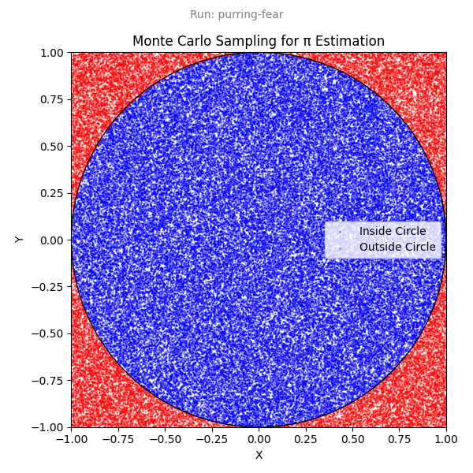

# Capsula サンプルリポジトリ

このリポジトリは Capsula の使用方法を示しています。

## 前提条件

- [Capsula](https://github.com/ut-issl/capsula)
- [uv](https://docs.astral.sh/uv/)

## サンプルの実行

### Capsula を使わずに実行

`uv` を使ってスクリプトを直接実行します：

```bash
uv run python scripts/calc_pi.py
```

これにより、推定された π の値がコンソールに出力され、プロットが `monte_carlo_pi_estimation.png` に出力されます。

サンプル数と乱数シードを指定できます：

```bash
uv run python scripts/calc_pi.py --n-samples 100000 --seed 42
```

### Capsula を使って実行

Capsula を使ってスクリプトを実行し、実行内容をキャプチャします：

```
❯ capsula run uv run python scripts/calc_pi.py --n-samples 100000 --seed 42
Run ID: 01KBHF79ZDF56GYAZFVZ1053JP, Name: purring-fear
Run directory: /Users/nomura/ghq/github.com/shunichironomura/capsula-example/.capsula/pi-estimation/2025-12-03/064330-purring-fear
Total samples: 100000
Points inside circle: 78507
Estimated value of π: 3.14028
```

Capsula の実行 ID、実行名、実行ディレクトリが表示されます。

実行ディレクトリには以下のファイルが含まれます：

```
.capsula/pi-estimation/2025-12-03/064330-purring-fear
├── _capsula
│   ├── command.json
│   ├── metadata.json
│   ├── post-run.json
│   └── pre-run.json
├── capsula-example.patch
├── capsula.toml
├── monte_carlo_pi_estimation.png
├── pyproject.toml
└── uv.lock
```

生成されたプロット `monte_carlo_pi_estimation.png` が実行ディレクトリに移動されていることに注目してください。

実行名がプロット画像に埋め込まれています：



すべての実行を一覧表示するには：

```
❯ capsula list
TIMESTAMP (UTC)      NAME                  COMMAND
-----------------------------------------------------------------------------------------------------------------
2025-12-03 06:43:30  purring-fear          uv run python scripts/calc_pi.py --n-samples 100000 --seed 42
2025-12-03 06:42:18  organic-honey         uv run python scripts/calc_pi.py --n-samples 10000 --seed 42
2025-12-03 06:42:09  fancy-cup             uv run python scripts/calc_pi.py
2025-12-03 06:35:54  calculating-geese     uv run python scripts/calc_pi.py --n-samples 100000 --seed 7
2025-12-03 06:35:32  incompetent-achieve   uv run python scripts/calc_pi.py --n-samples 100000 --seed 7
2025-12-03 06:33:41  cagey-bait            uv run python scripts/calc_pi.py --n-samples 100000 --seed 7
2025-12-03 06:33:25  bouncy-spiders        uv run python scripts/calc_pi.py
```

#### Capsula 設定のカスタマイズ

この例で使用されている設定については、[capsula.toml](./capsula.toml) ファイルを参照してください。
